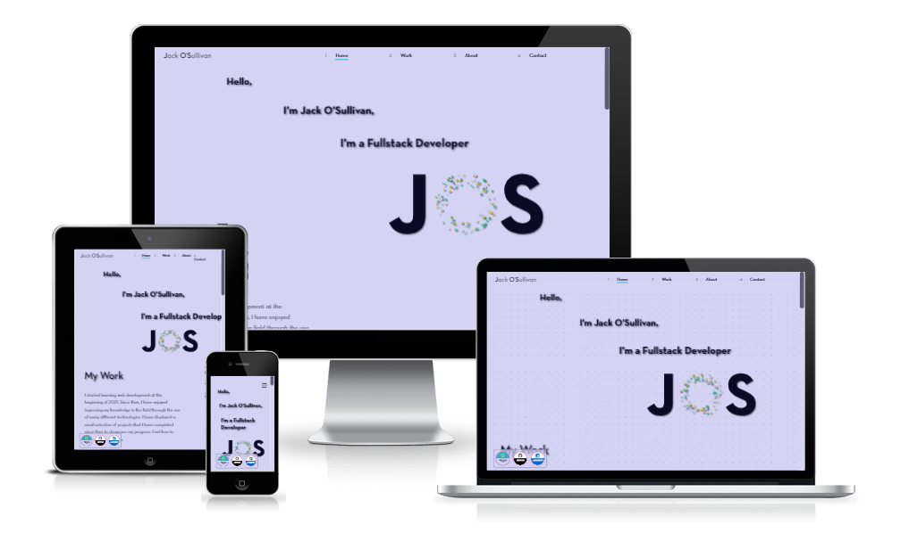

# **Jack O'Sullivan Personal Website/Portfolio**

[View the live app here](https://jackosullivan.ie)

The personal website/portfolio for Jack O'Sullivan. The project was built using React, Redux, d3js, animate.css and the sendinblue api.

## **Running the project**

1. Run 'npm install' from the terminal in both the server and client directories.

2. Create a [Sendinblue](https://www.sendinblue.com/) account and create an api key so that you can send emails.

3. Create a .env file and store your api key here. If in production create a PRODUCTION environment variable and set to true.
## **Notes on hosting**

The live version is hosted on a Ubuntu server on EC2 by AWS. The 'npm run build' command was executed to build the project from the client directory. After this nginx is used to create a reverse proxy and pm2 is used to run the backend. The SSL certificates were provided by Let's encrypt and Certbot.

## **License**

The design and implementation of this project took a significant amount of time and effort on my part. I am keeping this project open source so that those who wish to do so may take parts of the code in this project to use in their own projects. However, **please do not plagiarise** the design/features of this website and pass it/them off as your own work. Any use of the code from this project must be accompanied by **proper attribution**.
  

#### **Contact form images**

Screenshots of the successful and failed contact animations are linked below to satisfy the curiosity of those who wish to see them.

[Contact succeeded animation](contacted.PNG)

[Contact failed animation](contact-failed.PNG)